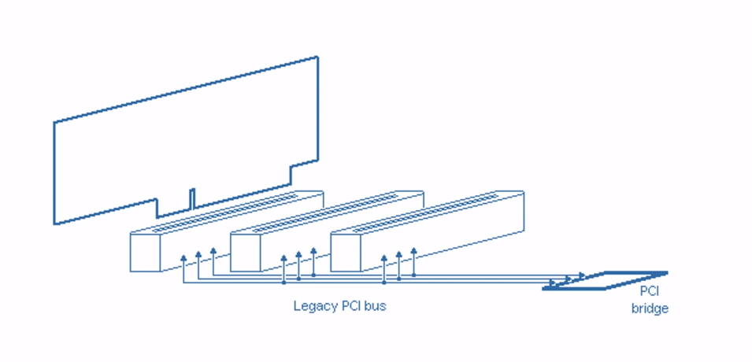

## David

1. Identify the entities that communicate with one another using this protocol.
   In most cases there are two entities with one acting as the client and the
   other as the server, or caller and callee. But in some protocols there may be
   three kinds of entities with a third entity acting as a manager, facilitator,
   or go-between.

Peripheral component interconnect express (PCIe) is a full duplex serial
communication interface often used in communication between a CPU and some high
speed peripheral. PCIe was originally designed in 2003 to replace the PCI (and
variations) and AGP parallel buses that were in place but were starting to run
up against bottlenecks preventing them from increasing bandwidth further. As a
parallel bus increases its operating frequency, jitter and skew become
significant problems to overcome.

PCIe is very similar to a modern LAN for its point-to-point connection
(like Ethernet) and the service it provides that is very similar to the
transport, data link, and physical layers in the computer network OSI model.
Where OSI has the transport layer, PCIe has the transaction layer. Where OSI

2. Describe how devices identify themselves on the network, and become known to
   other devices on the network. If initial connection involves a handshake,
   describe the handshake. If identities are given, describe how the identities
   are assured to be unique.

3. Discuss the issue of traffic and congestion. Describe how the network and
   protocol addresses the problem of either too many devices trying to use the
   network at the same time or trying to push too much data through the network.
   Do devices take turns (how do they know?). Do devices tell get told to stop
   or wait? Do devices get told to slow down or speed up? How are control
   signals separated from data?

## Sean
4. Discuss the issues of security.
   
   a. Does the protocol address the issue of
   privacy? If so, how? If not, what risks might exist?
   
   b. Does the protocol
   protect against malicious interlopers on the network? If so how? If not, how
   might the network be exploited or compromised by someone who could connect a
   malicious device to the network?
   
   c. How does the protocol recover after a
   failure, i.e. after a power outage or some other breakdown?

5. Is efficiency a concern? Does the protocol have features to optimize data
   transmission rates? What does it do to control or adjust speeds? What if
   different devices have different speed capabilities?

   Efficiency is a large concern for the PCIe protocol. One of the main reasons why you would want to use the PCIe protocol is for fast communication rates. The latest version of PCIe (version 5.0 at the time of writing this documentation) can obtain a maximum throughput of 63 GB/s using 16 lanes. One contributor that allows PCIe to achieve these fast transmission rates is each device has its own serial medium connecting to the root complex or host (in the scope of a general purpose computer the root complex or host would be the mother board). This typology varies drastically when compared to the PCI protocol which has all devices sharing one medium. This significantly limits the rate at which data could be transferred since only one devices could transmit data a time. Images depicting these difference in medium connection between the PCI and PCIe protocol are as follows.

   

   

   Given the extremely fast transmission rates, the tolerance for timing of bit transmission is not negligible. In order to ensure that bits are sent and received at the same rate between two devices an addition 2 bits are appended at the end of 8 bits.

6. How does the protocol address communication failures? What kinds of failures
   are addressed? Suggest two kinds of failures that are not addressed, and
   discuss what could happen to senders and receivers in a failure of that kind.

