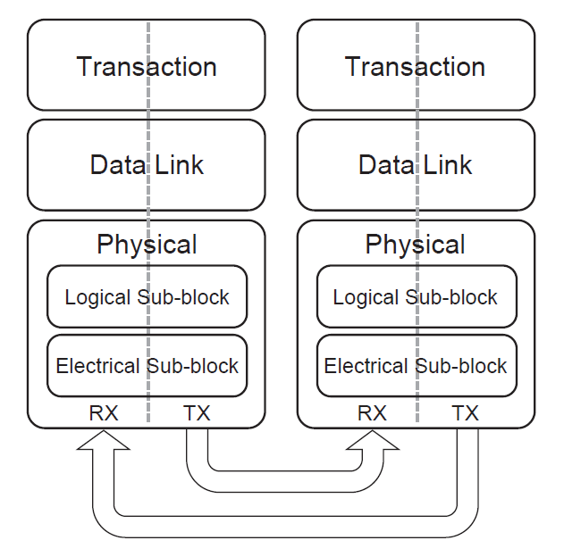
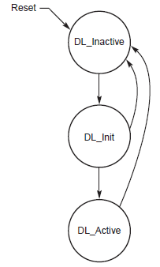
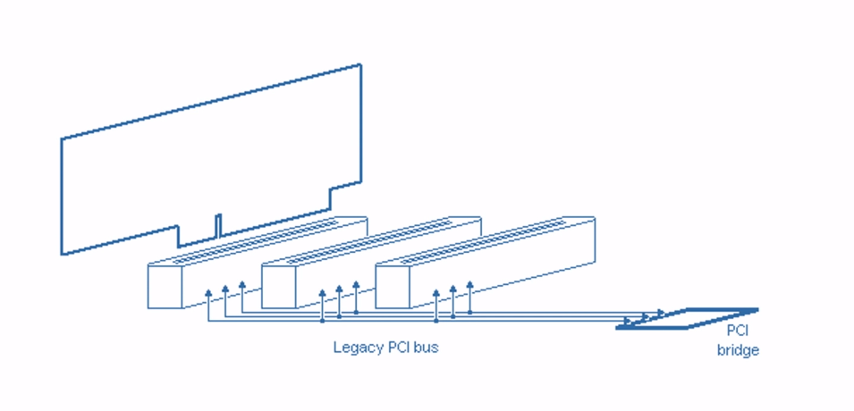
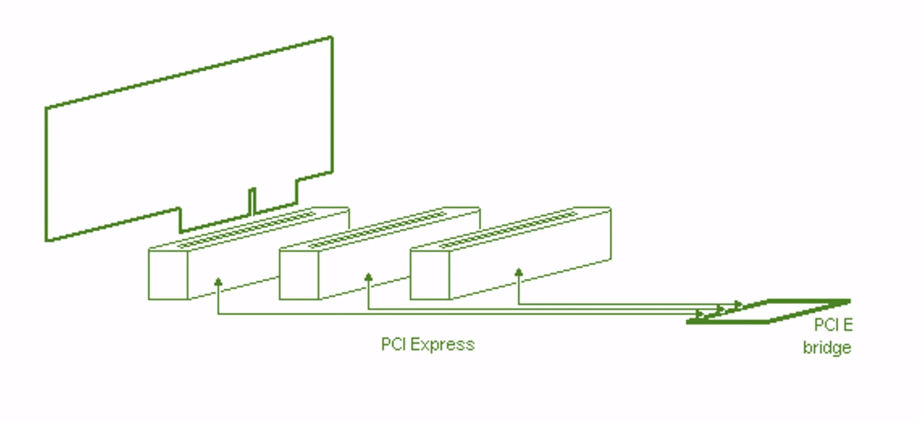
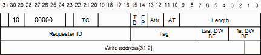

## David

1. Identify the entities that communicate with one another using this protocol.
   In most cases there are two entities with one acting as the client and the
   other as the server, or caller and callee. But in some protocols there may be
   three kinds of entities with a third entity acting as a manager, facilitator,
   or go-between.

   Peripheral component interconnect express (PCIe) is a full duplex serial
   communication interface often used in communication between a CPU and some
   high speed peripheral. Devices often connected using PCIe include graphics
   cards, high-speed Ethernet/Wi-Fi, and even some hard drives. The first
   revision of PCIe was designed in 2003 to replace the existing parallel buses
   PCI (and its variations) and AGP that were widely used but starting to run up
   against bottlenecks preventing further increases in bandwidth. As a parallel
   bus increases its operating frequency, jitter and skew become significant
   problems to overcome. The old conventional PCI, which was used as a general
   connection between a computer motherboard and various peripherals, used a 32
   or 64-bit parallel bus connection between devices. Additionally, the PCI bus
   was a true bus, with almost all wire connections shared by all devices using
   the bus. This meant that for a bus connection involving many devices, the
   electrical connection might need to travel a long distance and have high
   capacitance, which make increasing the bus's speed past the MHz range
   difficult. The parallel bus also needed many traces on the motherboard to
   route all required signals. AGP was another parallel interface used for
   graphics cards, subject to most of the same concerns as conventional PCI.

   For these reasons, the PCI special interest group (PCI-SIG) left parallel
   buses behind in favor of serial interfaces, which replace the problems
   discussed above with other difficulties that are challenging but possible to
   overcome. PCIe started to replace all uses of PCI and AGP in 2004, and it is
   used almost exclusively as the connection to CPU peripherals on modern
   motherboards.

### Layered Architecture

   PCIe implements an architecture of abstraction layers similar to the OSI
   network model. While the 5-layer OSI model has 4 supporting layers below the
   application layer, PCIe has a simple enough connection topology that it only
   uses three: transaction, data link, and physical layers. The 3 PCIe layers
   perform functions comparable to the lowest 4 layers of the OSI model, without
   the need for a network layer that handles routing between links in a
   complicated network topology. The PCIe layers are shown in the figure below.

   

   The uppermost layer of the PCIe stack is the transaction layer which fulfils
   a role like OSI's transport layer. The transaction layer handles information
   being sent through the PCIe link in a unit of information called a
   transaction layer packet (TLP), which carries different information depending
   on the type of transaction it is being used for. The four types of
   transactions supported by PCIe are memory, I/O, configuration, and message
   transactions, of which the three former were inherited from similar packet
   types in the PCI protocol. Message transactions, which were not part of
   earlier parallel interface standards, carry metadata about the link, such as
   interrupt requests, that were formerly handled by discrete wire connections
   in PCI.

   The next PCIe layer is the data link layer, analogous to the OSI layer of the
   same name. The PCIe data link layer is responsible for managing links between
   PCIe devices and ensuring reliable data delivery. The information that the
   data link layer adds to TLPs it receives from the transaction layer include a
   sequence number for uniquely identifying packets at reception and a CRC for
   ensuring that data being read from the link is valid. The data link layer
   often needs to communicate with the data link layer of another device for
   link management even when no transaction layer information needs to be sent.
   To meet this end, the layer produces a different kind of packet, called a
   data link layer packet (DLLP), which is distinct from a TLP.

   The lowest layer on the PCIe stack is the physical layer, which pertains to
   bits of a message from the layers above being sent along a hardware
   connection to be received by the physical layer on the other end of a link.
   The PCIe interface is capable of transferring information at incredibly high
   rates, in the GB/s range, so the physical connection needs to operate at a
   very high speed. Standard wire connections are subject to increased noise and
   power consumption when very high clock rates are involved, so to combat these
   negative effects PCIe uses differential pairs of electrical signals to
   transmit information.

2. Describe how devices identify themselves on the network, and become known to
   other devices on the network. If initial connection involves a handshake,
   describe the handshake. If identities are given, describe how the identities
   are assured to be unique.

   The PCIe link is managed by the data link layer using a finite state machine
   called the data link control and management state machine (DLCMSM). The
   DLCMSM can be in one of three states: DL_Inactive, DL_Init, or DL_Active,
   wherein the link has as status output either DL_Up or DL_Down. The names of
   the states follow what intuition implies, but they will be discussed in
   further detail below. The transitions between states in the DLCMSM are shown
   in the diagram below.

   
   
   In the DL_Inactive state, which is entered upon the device powering up, the link
   is non-operational or nothing is connected. The link can move to the DL_Init
   state if the data link layer receives a signal from the physical layer that
   the physical link is active. In this state the status is DL_Down.
   
   While in the DL_Init state, the link works at initializing the flow control
   (FC) to default values. This process has its own two states responsible for
   configuring enabled virtual channels for use. While in the first FC
   initialization state, the status is DL_Down, but upon moving to the second
   the status is finally DL_Up. If at any point during the FC init process the
   physical layer reports the that the physical link is down, the DLCMSM moves
   back to the DL_Inactive state. If the FC init completes successfully without
   the physical link going down, the DLCMSM moves on to the DL_Active state.
   Part of FC initialization involves configuring multiple devices on a switch
   with different traffic classes and virtual channels to differentiate between
   communication involving certain components but not others. This flow control
   information is persistent through the entire link for every message sent from
   one device to another. Initialization is primarily performed by the physical
   layer, which negotiates the number of lanes and data rate shared by
   communicating devices.

   Once every initialization step is complete, the link enters the DL_Active
   state, the normal operating mode for the PCIe link. In this state, TLPs and
   DLLPs can be transmitted over the physical layer as necessary and the
   transaction layer link only goes down if the physical link goes down,
   through device removal or failure.

3. Discuss the issue of traffic and congestion. Describe how the network and
   protocol addresses the problem of either too many devices trying to use the
   network at the same time or trying to push too much data through the network.
   Do devices take turns (how do they know?). Do devices tell get told to stop
   or wait? Do devices get told to slow down or speed up? How are control
   signals separated from data?

   PCIe is a point-to-point connection, so a single "bus" can only natively
   connect two devices. The PCIe topology includes at its base a root complex,
   the interface connecting PCIe links to the CPU through a parallel interface,
   typically on-chip. The root complex generally allows the CPU to have access
   to multiple PCIe links, but each link can only connect to one component at
   the other end. More devices can be connected using a switch, which allows a
   single link from the root complex to connect to multiple other devices,
   emulating a true bus. PCIe supports traffic control using what it calls
   traffic classes and virtual channels. The upstream (towards CPU) end of a
   switch can only have one physical PCIe port, so if the downstream end has
   multiple links to different devices they must multiplex the connection to the
   root complex. Each link to the downstream end of a switch is assigned a
   traffic class which can be thought of as a priority of the traffic associated
   with a given device. Discrete links connected to a PCIe channel are
   identified in part by their traffic class, contributing to something similar
   to an Ethernet MAC address, but on a much smaller and more dynamic scale.

   A major part of PCIe is that a physical connector can be used with any PCIe
   device of any capability, including vastly different bandwidth and number of
   lanes.

## Sean
4. Discuss the issues of security.

a. Does the protocol address the issue of privacy? If so, how? If not, what
   risks might exist?
   
b. Does the protocol protect against malicious interlopers on the network? If
   so how? If not, how might the network be exploited or compromised by someone
   who could connect a malicious device to the network?

   The PCIe protocol does not have features that directly address the issues of
   security. However, given the physical characteristics of the protocol,
   limited wire length for data transmissions and high operating frequencies.
   The hardware is difficult to tap from a distance. Should one want to access
   data being transmitted directly from PCIe communications, they would need
   direct access to the PCIe slots that facilitate communication between two
   devices.

c. How does the protocol recover after a failure, i.e. after a power outage or
   some other breakdown?

5. Is efficiency a concern? Does the protocol have features to optimize data
   transmission rates? What does it do to control or adjust speeds? What if
   different devices have different speed capabilities?

   Efficiency is a large concern for the PCIe protocol. One of the main reasons
   why you would want to use the PCIe protocol is for fast communication rates.
   The latest version of PCIe (version 5.0 at the time of writing this
   documentation) can obtain a maximum throughput of 64 GB/s using 16 lanes. One
   contributor that allows PCIe to achieve these fast transmission rates is each
   device has its own serial medium connecting to the root complex or switch.
   The purpose of the switch is to allow multiplex connections between the PCIe
   peripherals on a single link with the root complex or a switch. This varies
   drastically when compared to the PCI protocol which has all devices sharing
   one medium. The PCI medium connections significantly limits the rate at which
   data can be transferred since only one device can transmit data at a time.
   Images depicting these differences in medium connection between the PCI and
   PCIe protocol are as follows.

   

   

   It is worthy to note the PCIe protocol can mock the bus configuration of PCI
   using switches. This allows for software backwards compatibility between the
   two protocols.

   In order to ensure that bits are sent and received at the same rate between
   two devices an addition 2 bits are inserted for each 8. These added bits
   allow the phase locked loop (an additional piece of hardware) to measure the
   frequency at which signals are transmitted and synchronize devices.

6. How does the protocol address communication failures? What kinds of failures
   are addressed? Suggest two kinds of failures that are not addressed, and
   discuss what could happen to senders and receivers in a failure of that kind.

   The PCIe protocol accounts for transmission failures by ensuring that the
   stream of bits that were sent from a device, were the same as the ones
   received. This is achieved via Cyclic Redundancy Checks (CRC). In the case
   that the CRC identifies an error, a request will be sent to the sending
   device to resend those packets.

   One unaccounted possibility for error is in the transaction layer (the
   transaction layer is one level of abstraction above the data link layer and
   is specific to the PCIe protocol). The transaction layer has its own header
   and is as follows.

   <!---->

   The purpose of the Transaction Layer Packet (TLP) header is to interpret read
   and write instructions. Once the device has fulfilled the request of the read
   or write instruction, a new packet is sent back to the device that initiated
   the request. The PCIe protocol is unclear as to what steps are taken when
   more than one device share the same Requester ID.

